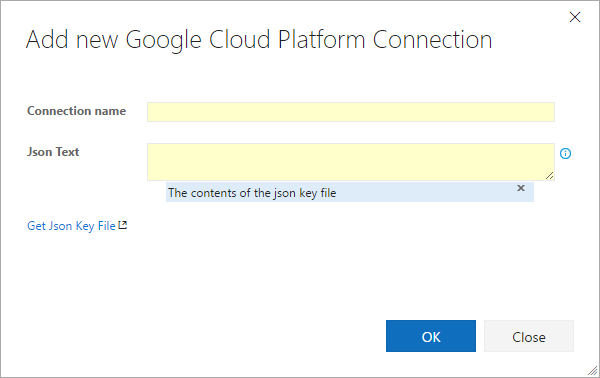
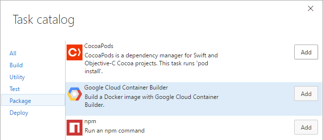
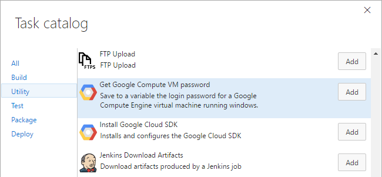

# Google Cloud Tools for Team Foundation Server

This extension provides a service endpoint and build tasks to make deploying to
Google Cloud Platform a breeze.

[TODO(przybjw) - Uncomment once live]: # (Quickstart and How-To documentation can be found at)
[TODO(przybjw) - Uncomment once live]: # (https://cloud.google.com/tools/cloud-tools-tfs/docs/community)

## Installation

Once the extension is installed, you need to install the [Google Cloud SDK][CloudSdkInstall]
on your build agents. Alternatively, you can run the [Install Google Cloud SDK][install-cloud-sdk]
build task at the beginning of your build.

## Service Endpoint

The provided build tasks connect to Google Cloud Platform through a service
endpoint.

Adding a Google Cloud Platform service endpoint is easy. Get a JSON key file
for your service account, copy the contents into the text area and name your
connection.

## Build Tasks

The extension installs the following tasks:

  
  
  
  - **[Deploy to Google App Engine][deploy-gae]**: Deploy ASP.NET Core and other
  application to [Google App Engine][AppEngine]
  - **[Deploy to Google Container Engine][deploy-gke]**: Deploy ASP.NET Core and
  other applications to [Google Container Engine][ContainerEngine]
  - **[Google Cloud Container Builder][container-build]**: Build Docker container
  images with [Google Container Builder][ContainerBuilder]
  - **[Get Google Compute VM password][set-login-password]**: Gets the IP address
  and user password for a [Google Compute Engine][ComputeEngine] virtual machine
  running windows.
  - **[Instance Group IPs][instance-group-ips]**: Collects the external IPs of an [instance group][InstanceGroup]
  and saves them to a build variable.
  - **[Install Google Cloud SDK][install-cloud-sdk]**: Windows only. Finds or installs the
  [Google Cloud SDK][CloudSdk].
  - **[Google Cloud SDK Tool Installer][cloud-sdk-tool]**: Installs the [Google Cloud SDK][CloudSdk] as a cached
  [VSTS Tool][vsts-tool].
  
[CloudSdk]: https://cloud.google.com/sdk
[CloudSdkInstall]: https://cloud.google.com/sdk/downloads
[AppEngine]: https://cloud.google.com/appengine
[ContainerEngine]: https://cloud.google.com/container-engine
[ContainerBuilder]: https://cloud.google.com/container-builder
[ComputeEngine]: https://cloud.google.com/compute
[InstanceGroup]: https://cloud.google.com/compute/docs/instance-groups
[vsts-tool]: https://docs.microsoft.com/en-us/vsts/build-release/concepts/process/tasks#tool-installers

[deploy-gae]: https://github.com/GoogleCloudPlatform/google-cloud-tfs/blob/master/deploy-gae-build-task/README.md
[deploy-gke]: https://github.com/GoogleCloudPlatform/google-cloud-tfs/blob/master/deploy-gke-build-task/README.md
[container-build]: https://github.com/GoogleCloudPlatform/google-cloud-tfs/blob/master/container-build-task/README.md
[set-login-password]: https://github.com/GoogleCloudPlatform/google-cloud-tfs/blob/master/set-login-build-task/README.md
[install-cloud-sdk]: https://github.com/GoogleCloudPlatform/google-cloud-tfs/blob/master/install-cloud-sdk-build-task/README.md
[cloud-sdk-tool]: https://github.com/GoogleCloudPlatform/google-cloud-tfs/blob/master/cloud-sdk-tool-build-task/README.md
[instance-group-ips]: https://github.com/GoogleCloudPlatform/google-cloud-tfs/blob/master/instance-group-ips-build-task/README.md
