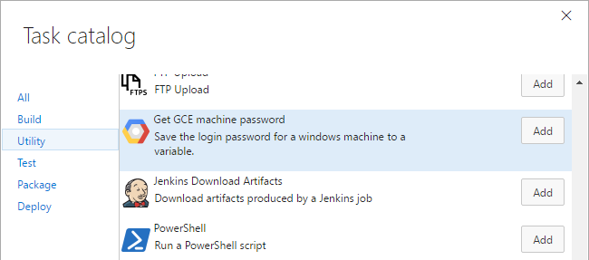

# Google Cloud Tools for Team Foundation Server

This extension provides a service endpoint and build tasks to make deploying to
Google Cloud Platform a breeze.

[TODO(przybjw)]:#(Validate on site documentaion link)
Quickstart and How-To documentation can be found at
https://cloud.google.com/tools/cloud-tools-tfs/docs/community

## Installation

Once the extension is installed, you need to install the
[Google Cloud SDK][CloudSdk] on your build agents.

## Service Endpoint

The provided build tasks connect to Google Cloud Platform through a service
endpoint.

Adding a Google Cloud Platform service endpoint is easy. Get a JSON key file
for your service account, copy the contents into the text area and name your
connection.

## Build Tasks

The extension installs the following tasks:

  
  
  
  - **[Deploy to Google App Engine](deploy-gae-build-task/README.md)**: Deploy ASP.NET Core and other application to [Google App Engine][AppEngine]
  - **[Deploy to Google Container Engine](deploy-gke-build-task/README.md)**: Deploy ASP.NET Core and other applications to [Google Container Engine][ContainerEngine]
  - **[Google Cloud Container Builder](container-build-task/README.md)**: Build Docker container images with [Google Container Builder][ContainerBuilder]
  - **[Get Google Compute VM password](set-login-build-task/README.md)**: Gets the IP address and user password for a [Google Compute Engine][ComputeEngine] virtual machine running windows.

[CloudSdk]: https://cloud.google.com/sdk/downloads
[AppEngine]: https://cloud.google.com/appengine
[ContainerEngine]: https://cloud.google.com/container-engine
[ContainerBuilder]: https://cloud.google.com/container-builder
[ComputeEngine]: https://cloud.google.com/compute
